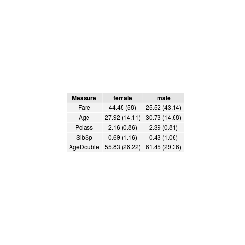

Outline and concepts for workshop
=================================

This `<-` command basically takes anything on the right hand side
and puts it into the left hand side.  Like an equation.  This is
called variable assignment.


```r
df <- read.csv('train.csv')
```

`head` checks only the first few rows of the dataset.


```r
head(df)
```

```
##   PassengerId Survived Pclass
## 1           1        0      3
## 2           2        1      1
## 3           3        1      3
## 4           4        1      1
## 5           5        0      3
## 6           6        0      3
##                                                  Name    Sex Age SibSp
## 1                             Braund, Mr. Owen Harris   male  22     1
## 2 Cumings, Mrs. John Bradley (Florence Briggs Thayer) female  38     1
## 3                              Heikkinen, Miss. Laina female  26     0
## 4        Futrelle, Mrs. Jacques Heath (Lily May Peel) female  35     1
## 5                            Allen, Mr. William Henry   male  35     0
## 6                                    Moran, Mr. James   male  NA     0
##   Parch           Ticket    Fare Cabin Embarked
## 1     0        A/5 21171  7.2500              S
## 2     0         PC 17599 71.2833   C85        C
## 3     0 STON/O2. 3101282  7.9250              S
## 4     0           113803 53.1000  C123        S
## 5     0           373450  8.0500              S
## 6     0           330877  8.4583              Q
```

`dim` checks the dimensions of the dataset (number of rows and
number of columns, in that order).


```r
dim(df)
```

```
## [1] 891  12
```

`str` checks the structure of the dataset, showing what the `df`
object is, what each item (or column) in the dataset is, such as
numeric, factor, etc.  This is pretty useful as it can give you a
quick overview of what the variables have been classified as and
if there are any problems.


```r
str(df)
```

```
## 'data.frame':	891 obs. of  12 variables:
##  $ PassengerId: int  1 2 3 4 5 6 7 8 9 10 ...
##  $ Survived   : int  0 1 1 1 0 0 0 0 1 1 ...
##  $ Pclass     : int  3 1 3 1 3 3 1 3 3 2 ...
##  $ Name       : Factor w/ 891 levels "Abbing, Mr. Anthony",..: 109 191 358 277 16 559 520 629 416 581 ...
##  $ Sex        : Factor w/ 2 levels "female","male": 2 1 1 1 2 2 2 2 1 1 ...
##  $ Age        : num  22 38 26 35 35 NA 54 2 27 14 ...
##  $ SibSp      : int  1 1 0 1 0 0 0 3 0 1 ...
##  $ Parch      : int  0 0 0 0 0 0 0 1 2 0 ...
##  $ Ticket     : Factor w/ 681 levels "110152","110413",..: 525 596 662 50 473 276 86 396 345 133 ...
##  $ Fare       : num  7.25 71.28 7.92 53.1 8.05 ...
##  $ Cabin      : Factor w/ 148 levels "","A10","A14",..: 1 83 1 57 1 1 131 1 1 1 ...
##  $ Embarked   : Factor w/ 4 levels "","C","Q","S": 4 2 4 4 4 3 4 4 4 2 ...
```

`class` checks only the type of object you are asking, not the
contents (unlike `str`).


```r
class(df)
```

```
## [1] "data.frame"
```

`summary` is an extremely useful command to check the basic
descriptive statistics (mean, median, range, count for factors).
I usually use this anytime I want to quickly look at my dataset,
to get a sense of it.


```r
summary(df)
```

```
##   PassengerId       Survived          Pclass     
##  Min.   :  1.0   Min.   :0.0000   Min.   :1.000  
##  1st Qu.:223.5   1st Qu.:0.0000   1st Qu.:2.000  
##  Median :446.0   Median :0.0000   Median :3.000  
##  Mean   :446.0   Mean   :0.3838   Mean   :2.309  
##  3rd Qu.:668.5   3rd Qu.:1.0000   3rd Qu.:3.000  
##  Max.   :891.0   Max.   :1.0000   Max.   :3.000  
##                                                  
##                                     Name         Sex           Age       
##  Abbing, Mr. Anthony                  :  1   female:314   Min.   : 0.42  
##  Abbott, Mr. Rossmore Edward          :  1   male  :577   1st Qu.:20.12  
##  Abbott, Mrs. Stanton (Rosa Hunt)     :  1                Median :28.00  
##  Abelson, Mr. Samuel                  :  1                Mean   :29.70  
##  Abelson, Mrs. Samuel (Hannah Wizosky):  1                3rd Qu.:38.00  
##  Adahl, Mr. Mauritz Nils Martin       :  1                Max.   :80.00  
##  (Other)                              :885                NA's   :177    
##      SibSp           Parch             Ticket         Fare       
##  Min.   :0.000   Min.   :0.0000   1601    :  7   Min.   :  0.00  
##  1st Qu.:0.000   1st Qu.:0.0000   347082  :  7   1st Qu.:  7.91  
##  Median :0.000   Median :0.0000   CA. 2343:  7   Median : 14.45  
##  Mean   :0.523   Mean   :0.3816   3101295 :  6   Mean   : 32.20  
##  3rd Qu.:1.000   3rd Qu.:0.0000   347088  :  6   3rd Qu.: 31.00  
##  Max.   :8.000   Max.   :6.0000   CA 2144 :  6   Max.   :512.33  
##                                   (Other) :852                   
##          Cabin     Embarked
##             :687    :  2   
##  B96 B98    :  4   C:168   
##  C23 C25 C27:  4   Q: 77   
##  G6         :  4   S:644   
##  C22 C26    :  3           
##  D          :  3           
##  (Other)    :186
```

If you want to see specific columns or rows, you can use the `[`
command.  The first number is the row `[row, ]`, and the second
number is the column `[, column]`.  So together: `[row, column]`.


```r
df[1:2, 1:5]
```

```
##   PassengerId Survived Pclass
## 1           1        0      3
## 2           2        1      1
##                                                  Name    Sex
## 1                             Braund, Mr. Owen Harris   male
## 2 Cumings, Mrs. John Bradley (Florence Briggs Thayer) female
```

Also, numbers can be put together like so:


```r
1:10
```

```
##  [1]  1  2  3  4  5  6  7  8  9 10
```

```r
-1:10
```

```
##  [1] -1  0  1  2  3  4  5  6  7  8  9 10
```

```r
1:-10
```

```
##  [1]   1   0  -1  -2  -3  -4  -5  -6  -7  -8  -9 -10
```

```r
-10:1
```

```
##  [1] -10  -9  -8  -7  -6  -5  -4  -3  -2  -1   0   1
```

In dataframes, a negative number means remove:


```r
df[1:2, ]
```

```
##   PassengerId Survived Pclass
## 1           1        0      3
## 2           2        1      1
##                                                  Name    Sex Age SibSp
## 1                             Braund, Mr. Owen Harris   male  22     1
## 2 Cumings, Mrs. John Bradley (Florence Briggs Thayer) female  38     1
##   Parch    Ticket    Fare Cabin Embarked
## 1     0 A/5 21171  7.2500              S
## 2     0  PC 17599 71.2833   C85        C
```

```r
df[1:2, -2:-4]
```

```
##   PassengerId    Sex Age SibSp Parch    Ticket    Fare Cabin Embarked
## 1           1   male  22     1     0 A/5 21171  7.2500              S
## 2           2 female  38     1     0  PC 17599 71.2833   C85        C
```

You can use strings (real words) to select a specific column.


```r
df[1:2, 'Age']
```

```
## [1] 22 38
```

You can use the combine command `c()` to put two strings or
numbers together.


```r
df[c(1, 4), c('Age', 'Sex')]
```

```
##   Age    Sex
## 1  22   male
## 4  35 female
```

You can also subset the data using these commands:


```r
head(df[df$Sex == 'male', ])
```

```
##    PassengerId Survived Pclass                           Name  Sex Age
## 1            1        0      3        Braund, Mr. Owen Harris male  22
## 5            5        0      3       Allen, Mr. William Henry male  35
## 6            6        0      3               Moran, Mr. James male  NA
## 7            7        0      1        McCarthy, Mr. Timothy J male  54
## 8            8        0      3 Palsson, Master. Gosta Leonard male   2
## 13          13        0      3 Saundercock, Mr. William Henry male  20
##    SibSp Parch    Ticket    Fare Cabin Embarked
## 1      1     0 A/5 21171  7.2500              S
## 5      0     0    373450  8.0500              S
## 6      0     0    330877  8.4583              Q
## 7      0     0     17463 51.8625   E46        S
## 8      3     1    349909 21.0750              S
## 13     0     0 A/5. 2151  8.0500              S
```

```r
head(df[c(df$Sex == 'male', df$Age < 40), ])
```

```
##    PassengerId Survived Pclass                           Name  Sex Age
## 1            1        0      3        Braund, Mr. Owen Harris male  22
## 5            5        0      3       Allen, Mr. William Henry male  35
## 6            6        0      3               Moran, Mr. James male  NA
## 7            7        0      1        McCarthy, Mr. Timothy J male  54
## 8            8        0      3 Palsson, Master. Gosta Leonard male   2
## 13          13        0      3 Saundercock, Mr. William Henry male  20
##    SibSp Parch    Ticket    Fare Cabin Embarked
## 1      1     0 A/5 21171  7.2500              S
## 5      0     0    373450  8.0500              S
## 6      0     0    330877  8.4583              Q
## 7      0     0     17463 51.8625   E46        S
## 8      3     1    349909 21.0750              S
## 13     0     0 A/5. 2151  8.0500              S
```


`dplyr` and `tidyr` approach
----------------------------

However, these are a bit complicated, and hard to read!  There is
a better way.  Install and/or load these packages:


```r
install.packages('dplyr')
install.packages('tidyr')
```

```r
library(dplyr)
library(tidyr)
```

To do the same as the above, use:


```r
df %>%
  filter(Sex == 'male', Age < 40) %>%
  ## You can keep chaining
  tbl_df() %>%
  ## ... and chaining
  select(Sex, Age, Pclass, Parch) %>%
  ## ... and chaining
  summary()
```

```
##      Sex           Age            Pclass          Parch       
##  female:  0   Min.   : 0.42   Min.   :1.000   Min.   :0.0000  
##  male  :344   1st Qu.:19.00   1st Qu.:2.000   1st Qu.:0.0000  
##               Median :25.00   Median :3.000   Median :0.0000  
##               Mean   :24.28   Mean   :2.494   Mean   :0.2878  
##               3rd Qu.:31.00   3rd Qu.:3.000   3rd Qu.:0.0000  
##               Max.   :39.00   Max.   :3.000   Max.   :5.0000
```

The extremely useful `%>%` chain, or pipe command, is just like in
the shell/terminal. It takes the output of the previous command
and inputs it into the next command.  Otherwise, without the `%>%`
pipe, it looks like:


```r
summary(select(tbl_df(filter(df, Sex == 'male', Age < 40)), Sex, Age, Pclass, Parch))
```

```
##      Sex           Age            Pclass          Parch       
##  female:  0   Min.   : 0.42   Min.   :1.000   Min.   :0.0000  
##  male  :344   1st Qu.:19.00   1st Qu.:2.000   1st Qu.:0.0000  
##               Median :25.00   Median :3.000   Median :0.0000  
##               Mean   :24.28   Mean   :2.494   Mean   :0.2878  
##               3rd Qu.:31.00   3rd Qu.:3.000   3rd Qu.:0.0000  
##               Max.   :39.00   Max.   :3.000   Max.   :5.0000
```

The pipe does this by basically making the output be named `.`, so
really, the pipe is doing this:


```r
df %>% select(., Fare, Sex) %>%
  filter(., Sex == 'male') %>%
  select(., Fare) %>%
  round(., 3) %>%
  head(.)
```

```
##     Fare
## 1  7.250
## 2  8.050
## 3  8.458
## 4 51.862
## 5 21.075
## 6  8.050
```

`tbl_df` makes the dataframe also a tbl object, so that the outout
can be printed easily.  The verbs for dplyr are:

* select
* filter
* mutate
* summarise
* arrange
* group_by

For more explanation of dplyr, check the documentation:
https://github.com/hadley/dplyr or run this command
`vignette('introduction', package = 'dplyr')`

The `tbl_df()` function makes the printing prettier.


```r
df <- tbl_df(df)
df %>% summary
```

```
##   PassengerId       Survived          Pclass     
##  Min.   :  1.0   Min.   :0.0000   Min.   :1.000  
##  1st Qu.:223.5   1st Qu.:0.0000   1st Qu.:2.000  
##  Median :446.0   Median :0.0000   Median :3.000  
##  Mean   :446.0   Mean   :0.3838   Mean   :2.309  
##  3rd Qu.:668.5   3rd Qu.:1.0000   3rd Qu.:3.000  
##  Max.   :891.0   Max.   :1.0000   Max.   :3.000  
##                                                  
##                                     Name         Sex           Age       
##  Abbing, Mr. Anthony                  :  1   female:314   Min.   : 0.42  
##  Abbott, Mr. Rossmore Edward          :  1   male  :577   1st Qu.:20.12  
##  Abbott, Mrs. Stanton (Rosa Hunt)     :  1                Median :28.00  
##  Abelson, Mr. Samuel                  :  1                Mean   :29.70  
##  Abelson, Mrs. Samuel (Hannah Wizosky):  1                3rd Qu.:38.00  
##  Adahl, Mr. Mauritz Nils Martin       :  1                Max.   :80.00  
##  (Other)                              :885                NA's   :177    
##      SibSp           Parch             Ticket         Fare       
##  Min.   :0.000   Min.   :0.0000   1601    :  7   Min.   :  0.00  
##  1st Qu.:0.000   1st Qu.:0.0000   347082  :  7   1st Qu.:  7.91  
##  Median :0.000   Median :0.0000   CA. 2343:  7   Median : 14.45  
##  Mean   :0.523   Mean   :0.3816   3101295 :  6   Mean   : 32.20  
##  3rd Qu.:1.000   3rd Qu.:0.0000   347088  :  6   3rd Qu.: 31.00  
##  Max.   :8.000   Max.   :6.0000   CA 2144 :  6   Max.   :512.33  
##                                   (Other) :852                   
##          Cabin     Embarked
##             :687    :  2   
##  B96 B98    :  4   C:168   
##  C23 C25 C27:  4   Q: 77   
##  G6         :  4   S:644   
##  C22 C26    :  3           
##  D          :  3           
##  (Other)    :186
```

```r
df %>%
  ## subset the data by SibSp
  filter(SibSp >= 2) %>%
  ## select only the relevant columns
  select(Age, Sex, Survived, Cabin, Fare) %>%
  ## order the data (in descending) by Age
  arrange(Age) %>%
  ## create a new column
  mutate(d.Fare = cut(Fare, 3, labels = c('Low', 'Middle', 'High')))
```

```
## Source: local data frame [74 x 6]
## 
##     Age    Sex Survived Cabin    Fare d.Fare
## 1  0.75 female        1       19.2583    Low
## 2  0.75 female        1       19.2583    Low
## 3  1.00   male        0       39.6875    Low
## 4  1.00   male        1    F4 39.0000    Low
## 5  1.00   male        0       46.9000    Low
## 6  2.00   male        0       21.0750    Low
## 7  2.00   male        0       29.1250    Low
## 8  2.00 female        0       31.2750    Low
## 9  2.00 female        0       27.9000    Low
## 10 2.00   male        0       39.6875    Low
## ..  ...    ...      ...   ...     ...    ...
```

To do even more interesting things, we can combine the dplyr
package with the tidyr package.  The tidyr has basically two main
verbs:

* gather
* spread


```r
df %>%
  filter(SibSp >= 2) %>%
  select(Age, Sex, Survived, Cabin, Fare) %>%
  ## convert the data into a very long format
  gather(Measure, Value, -Sex) %>%
  ## make each summarise command run on the groups Sex and Measure
  group_by(Sex, Measure) %>%
  ## create summary statistics, in this cause the sample in each group
  ## (Sex and Measure)
  summarise(n = n()) %>%
  ## convert the data into a wide format
  spread(Sex, n)
```

```
## Warning: attributes are not identical across measure variables; they will
## be dropped
```

```
## Source: local data frame [4 x 3]
## 
##    Measure female male
## 1      Age     34   40
## 2 Survived     34   40
## 3    Cabin     34   40
## 4     Fare     34   40
```

Check the content again:


```r
df %>% summary
```

```
##   PassengerId       Survived          Pclass     
##  Min.   :  1.0   Min.   :0.0000   Min.   :1.000  
##  1st Qu.:223.5   1st Qu.:0.0000   1st Qu.:2.000  
##  Median :446.0   Median :0.0000   Median :3.000  
##  Mean   :446.0   Mean   :0.3838   Mean   :2.309  
##  3rd Qu.:668.5   3rd Qu.:1.0000   3rd Qu.:3.000  
##  Max.   :891.0   Max.   :1.0000   Max.   :3.000  
##                                                  
##                                     Name         Sex           Age       
##  Abbing, Mr. Anthony                  :  1   female:314   Min.   : 0.42  
##  Abbott, Mr. Rossmore Edward          :  1   male  :577   1st Qu.:20.12  
##  Abbott, Mrs. Stanton (Rosa Hunt)     :  1                Median :28.00  
##  Abelson, Mr. Samuel                  :  1                Mean   :29.70  
##  Abelson, Mrs. Samuel (Hannah Wizosky):  1                3rd Qu.:38.00  
##  Adahl, Mr. Mauritz Nils Martin       :  1                Max.   :80.00  
##  (Other)                              :885                NA's   :177    
##      SibSp           Parch             Ticket         Fare       
##  Min.   :0.000   Min.   :0.0000   1601    :  7   Min.   :  0.00  
##  1st Qu.:0.000   1st Qu.:0.0000   347082  :  7   1st Qu.:  7.91  
##  Median :0.000   Median :0.0000   CA. 2343:  7   Median : 14.45  
##  Mean   :0.523   Mean   :0.3816   3101295 :  6   Mean   : 32.20  
##  3rd Qu.:1.000   3rd Qu.:0.0000   347088  :  6   3rd Qu.: 31.00  
##  Max.   :8.000   Max.   :6.0000   CA 2144 :  6   Max.   :512.33  
##                                   (Other) :852                   
##          Cabin     Embarked
##             :687    :  2   
##  B96 B98    :  4   C:168   
##  C23 C25 C27:  4   Q: 77   
##  G6         :  4   S:644   
##  C22 C26    :  3           
##  D          :  3           
##  (Other)    :186
```

Compare the means of continuous variables of those who survived
and those who didn't.


```r
prep.table <- df %>%
  select(Survived, Age, Pclass, SibSp, Parch, Fare) %>%
  gather(Measure, Value, -Survived) %>%
  group_by(Survived, Measure) %>%
  ## remove missing values
  na.omit() %>%
  ## create a summary statistic (means)
  summarise(mean = mean(Value) %>% round(2)) %>%
  spread(Survived, mean)

prep.table
```

```
## Source: local data frame [5 x 3]
## 
##   Measure     0     1
## 1     Age 30.63 28.34
## 2  Pclass  2.53  1.95
## 3   SibSp  0.55  0.47
## 4   Parch  0.33  0.46
## 5    Fare 22.12 48.40
```

This can be created into a markdown table, so that it can be
easily put into a manuscript or report.  A very useful package is
called `pander` which allows you to create markdown tables.


```r
install.packages('pander')
```

```r
library(pander)
prep.table %>% pander(style = 'rmarkdown')
```


|  Measure  |   0   |   1   |
|:---------:|:-----:|:-----:|
|    Age    | 30.63 | 28.34 |
|  Pclass   | 2.53  | 1.95  |
|   SibSp   | 0.55  | 0.47  |
|   Parch   | 0.33  | 0.46  |
|   Fare    | 22.12 | 48.4  |

There is also join commands from dplyr:

* left_join
* outer_join
* inner_join
* anti_join

Code used in workshop
=====================

Exact code used in the workshop


```r
ds <- df
ds %>% select(., Sex, Cabin, Fare) %>%
    filter(., Sex == 'female', Fare > 10)
```

```
## Source: local data frame [250 x 3]
## 
##       Sex Cabin    Fare
## 1  female   C85 71.2833
## 2  female  C123 53.1000
## 3  female       11.1333
## 4  female       30.0708
## 5  female    G6 16.7000
## 6  female  C103 26.5500
## 7  female       16.0000
## 8  female       18.0000
## 9  female       21.0750
## 10 female       31.3875
## ..    ...   ...     ...
```

```r
filter(select(ds, Sex, Cabin, Fare),
       Sex == 'female')
```

```
## Source: local data frame [314 x 3]
## 
##       Sex Cabin    Fare
## 1  female   C85 71.2833
## 2  female        7.9250
## 3  female  C123 53.1000
## 4  female       11.1333
## 5  female       30.0708
## 6  female    G6 16.7000
## 7  female  C103 26.5500
## 8  female        7.8542
## 9  female       16.0000
## 10 female       18.0000
## ..    ...   ...     ...
```

```r
ds %>%
    select(Sex, Cabin, Fare) %>%
    mutate(newcol = 10 * Fare) %>%
    arrange(Fare)
```

```
## Source: local data frame [891 x 4]
## 
##     Sex Cabin Fare newcol
## 1  male          0      0
## 2  male   B94    0      0
## 3  male          0      0
## 4  male          0      0
## 5  male          0      0
## 6  male          0      0
## 7  male          0      0
## 8  male          0      0
## 9  male          0      0
## 10 male          0      0
## ..  ...   ...  ...    ...
```

```r
ds %>%
    select(Sex, Age, Fare) %>%
    group_by(Sex) %>%
    na.omit() %>%
    summarise(n = n(),
              mean = mean(Age))
```

```
## Source: local data frame [2 x 3]
## 
##      Sex   n     mean
## 1 female 261 27.91571
## 2   male 453 30.72664
```

Remove a column using the `-` sign.


```r
ds %>% select(-Age)
```

```
## Source: local data frame [891 x 11]
## 
##    PassengerId Survived Pclass
## 1            1        0      3
## 2            2        1      1
## 3            3        1      3
## 4            4        1      1
## 5            5        0      3
## 6            6        0      3
## 7            7        0      1
## 8            8        0      3
## 9            9        1      3
## 10          10        1      2
## ..         ...      ...    ...
## Variables not shown: Name (fctr), Sex (fctr), SibSp (int), Parch (int),
##   Ticket (fctr), Fare (dbl), Cabin (fctr), Embarked (fctr)
```

```r
prep.table2 <- ds %>%
    select(Sex, Fare, Age, Pclass, SibSp) %>%
    mutate(AgeDouble = Age * 2) %>%
    gather(Measure, Value, -Sex) %>%
    na.omit() %>%
    group_by(Sex, Measure) %>%
    ## create a column with the mean and standard deviation
    summarise(meanSD = paste0(mean(Value) %>% round(2),
                             ' (', sd(Value) %>% round(2),
                             ')')) %>%
    spread(Sex, meanSD)

prep.table2
```

```
## Source: local data frame [5 x 3]
## 
##     Measure        female          male
## 1      Fare    44.48 (58) 25.52 (43.14)
## 2       Age 27.92 (14.11) 30.73 (14.68)
## 3    Pclass   2.16 (0.86)   2.39 (0.81)
## 4     SibSp   0.69 (1.16)   0.43 (1.06)
## 5 AgeDouble 55.83 (28.22) 61.45 (29.36)
```

Create a table, with a caption!


```r
pander(prep.table2, style = 'rmarkdown',
       caption = 'Testing caption for this table!')
```


|  Measure  |    female     |     male      |
|:---------:|:-------------:|:-------------:|
|   Fare    |  44.48 (58)   | 25.52 (43.14) |
|    Age    | 27.92 (14.11) | 30.73 (14.68) |
|  Pclass   |  2.16 (0.86)  |  2.39 (0.81)  |
|   SibSp   |  0.69 (1.16)  |  0.43 (1.06)  |
| AgeDouble | 55.83 (28.22) | 61.45 (29.36) |

Table: Testing caption for this table!

To use the `grid.table` function instead of `pander`, load the
`gridExtra` package.  You may need to install first
(`install.packages('gridExtra')`).


```r
library(gridExtra)
grid.table(prep.table2, rows = NULL)
```

 

A package that does a tutorial *within* R!  I've heard good things
from it.


```r
install.packages('swirl')
```

To see help files, you can run the `vignette` command.


```r
vignette('introduction', package = 'dplyr')
```


